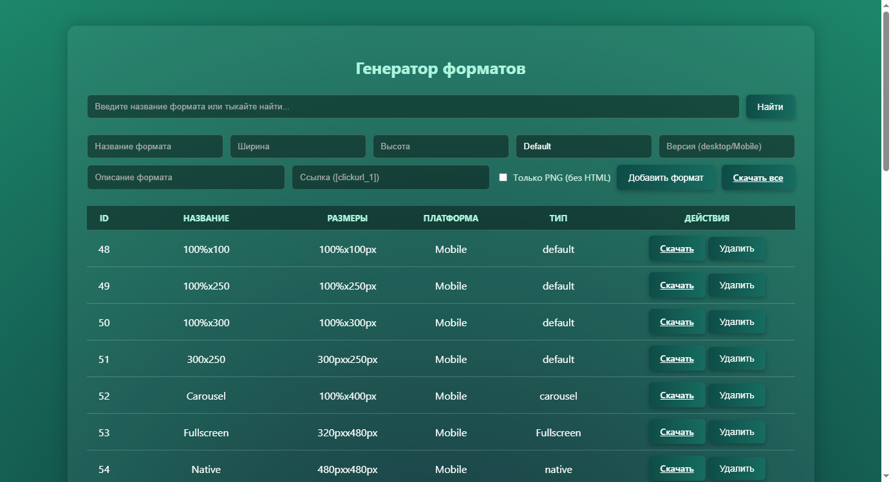
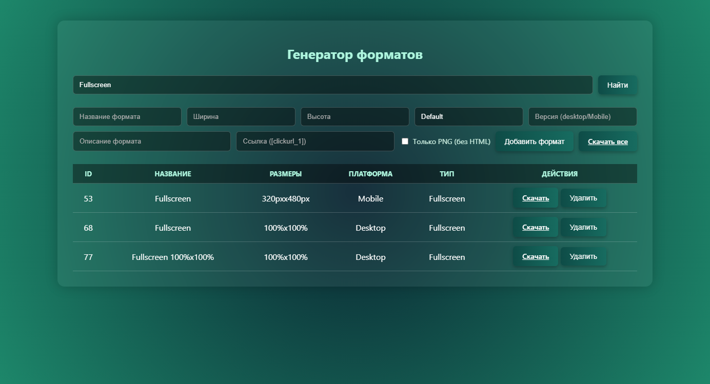

# 🎨 Creative Generator Flask

Веб-приложение для автоматической генерации рекламных баннеров различных форматов.

> Генерируй HTML-баннеры, PNG-скриншоты и TXT-конфиги одним кликом.

---

## 📸 Скриншоты

**Главная страница - список форматов**



**Поиск по форматам**



**Сгенерированный баннер (Billboard 970×250)**


---

## ✨ Возможности

- ✅ Генерация HTML-баннеров из Jinja2-шаблонов
- ✅ Рендеринг PNG-скриншотов через Selenium (headless Chrome)
- ✅ Автоматическое создание TXT-конфигов с параметрами
- ✅ Управление форматами (добавление, поиск, удаление)
- ✅ Скачивание отдельных форматов или всех сразу (ZIP)
- ✅ Поддержка 15+ типов шаблонов: Billboard, Fullscreen, Popup, Interscroller, Carousel, Show-up, Floating Billboard и др.
- ✅ Два варианта рендеринга: HTML и скриншотный

---

## 🛠 Технологии

- Python
- Flask
- Jinja2
- Selenium + ChromeDriver
- Pillow
- NumPy
- SQLite

---

## 🚀 Установка

```bash
git clone https://github.com/SilenceYaByte/creative_generator_flask.git
cd creative_generator_flask

python -m venv venv

# Windows
venv\Scripts\activate

# Linux/macOS
source venv/bin/activate

pip install -r requirements.txt
```

Также необходим Google Chrome и ChromeDriver (автоматически устанавливается через `webdriver-manager`).

---

## ▶️ Запуск

```bash
python app.py
```

Приложение доступно по адресу: `http://localhost:5050`

---

## 📂 Структура проекта

```
creative_generator_flask/
├── app.py                      # Flask-приложение (роуты, инициализация БД)
├── utils/
│   ├── generator.py            # Логика генерации баннеров (HTML, TXT)
│   └── image_generator.py      # Рендеринг PNG из HTML (Selenium)
├── templates/
│   ├── index.html              # Главная страница интерфейса
│   └── html_templates/         # Jinja2-шаблоны рекламных форматов
│       ├── base.html
│       ├── base_shot.html
│       ├── billboard.html
│       ├── fullscreen.html
│       ├── popup.html
│       ├── carousel.html
│       └── ...
├── static/
│   └── style.css               # Стили интерфейса
├── formats.db                  # SQLite база (генерируется автоматически)
├── generated/                  # Папка сгенерированных файлов
├── requirements.txt
├── LICENSE
└── README.md
```

---

## 🧠 Что было изучено

- Работа с Flask (роуты, шаблоны, flash-сообщения, отправка файлов)
- Jinja2-шаблонизация для генерации HTML-баннеров
- Selenium WebDriver для скриншотов в headless-режиме
- Работа с SQLite (создание таблиц, CRUD-операции)
- Формирование ZIP-архивов на лету (BytesIO)
- Адаптивные CSS-шаблоны с CSS clamp() и медиа-запросами

---

## 🔮 Планы развития

- Расширение библиотеки шаблонов
- Экспорт в другие форматы

---

## 📄 Лицензия

MIT
